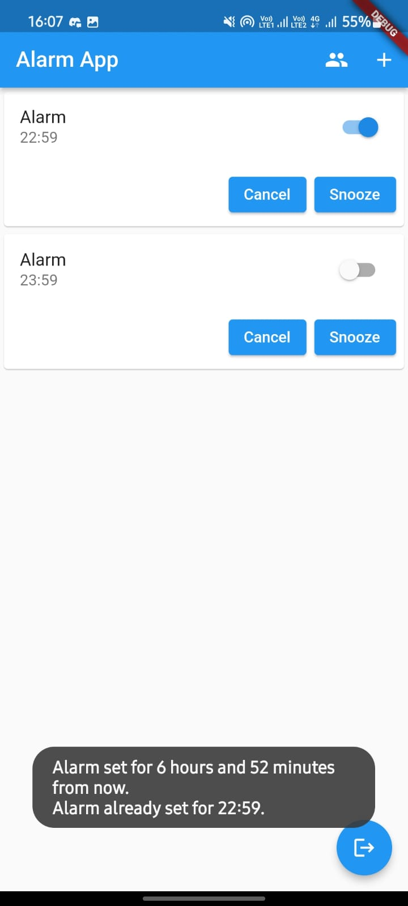

# Group_Alarm_App

Use this app to create synchronous alarms among your friends. Key Technologies used here are Flutter and Google Firebase.

## Getting Started

This project is a starting point for a Flutter application.

A few resources to get you started if this is your first Flutter project:

- [Lab: Write your first Flutter app](https://docs.flutter.dev/get-started/codelab)
- [Cookbook: Useful Flutter samples](https://docs.flutter.dev/cookbook)

For help getting started with Flutter development, view the
[online documentation](https://docs.flutter.dev/), which offers tutorials,
samples, guidance on mobile development, and a full API reference.

## Screenshots

Sign In or Log In Page

Sign Up Page

Log In Page

Home Screen

Group Page

Create Alarm

## Features

- Create Alarm
- Create Groups
- Common alarm for Groups
- Admin can add/remove members from the group.
